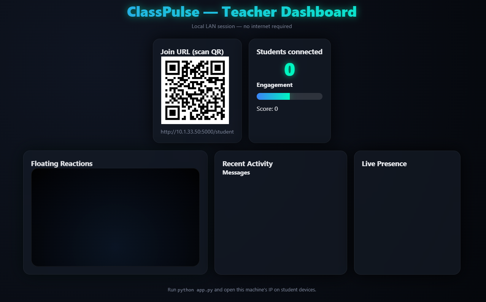

# 🧠 ClassPulse — Real-Time Classroom Engagement Dashboard



ClassPulse is a **local LAN-based classroom engagement tool** that helps teachers track student participation, reactions, and live presence — all in real time, without needing an internet connection.

---

## 🚀 Overview

ClassPulse provides an interactive **Teacher Dashboard** and a **Student Web Interface** to monitor and enhance classroom engagement.  
Teachers can visualize live reactions, monitor activity, and measure participation scores instantly — all running locally.

---

## ✨ Features

- 📡 **Offline LAN Mode** — Works seamlessly without internet access.  
- 🎯 **Real-Time Engagement Tracking** — Displays connected students, engagement score, and reactions.  
- 💬 **Floating Reactions** — Students can send emoji-based reactions (👍 👎 ❤️ 😮 😂).  
- 🧍‍♂️ **Live Presence** — Instantly shows active students.  
- 🔗 **QR Code Join System** — Students join easily by scanning a QR or using a LAN link.  
- 🧾 **Recent Activity Feed** — Displays live messages and reactions from students.

---

## 🧩 System Architecture

ClassPulse is a **Flask-based web app** running on a **local network (LAN)** to ensure fast, private, and offline communication.

### Components:
1. **Teacher Dashboard**
   - Shows QR code for students to join  
   - Displays live metrics: connected students, engagement, and reactions  
   - Visual panels for activity and presence  

2. **Student Interface**
   - Join via QR or local IP  
   - Send reactions and quick messages  
   - Participate anonymously  

3. **Backend (Python + Flask + SocketIO)**
   - Handles real-time socket communication  
   - Updates engagement metrics live  
   - Stores session data temporarily in memory  

---

## ⚙️ Installation & Setup

### 1️⃣ Clone the Repository
```bash
git clone https://github.com/yourusername/ClassPulse-RealTime-Classroom-Engagement.git
cd ClassPulse-RealTime-Classroom-Engagement
2️⃣ Install Dependencies
Ensure you have Python 3.9+ installed:

bash
Copy code
pip install -r requirements.txt
3️⃣ Run the Application
bash
Copy code
python app.py
4️⃣ Connect Devices
Make sure teacher and students are on the same Wi-Fi/LAN.

The dashboard will show a QR code and local IP link (e.g., http://10.1.33.50:5000/student).

Students scan the QR or open the link to join.

🖥️ Dashboard Preview
Teacher Dashboard	Student Interface
(Add Student Interface screenshot here if available)

📁 Folder Structure
php
Copy code
classpulse/
│
├── app.py                # Main Flask app
├── static/               # CSS, JS, and assets
├── templates/            # HTML templates
├── requirements.txt      # Dependencies
├── README.md             # Documentation
└── class-pulse.png       # Dashboard preview image
🧠 Tech Stack
Frontend: HTML, CSS, JavaScript

Backend: Python (Flask)

Networking: Local IP (LAN communication)

QR Code Generation: Python qrcode library

Real-time Updates: Flask-SocketIO

📦 Example requirements.txt
txt
Copy code
Flask==3.0.0
Flask-SocketIO==5.3.6
eventlet==0.33.3
qrcode==7.4.2
Pillow==10.0.1
(Add this file to your project root for quick setup.)

🔮 Future Enhancements
✅ Save session history and logs

✅ Add student identification

✅ Integrate live quizzes and polls

✅ Generate downloadable engagement reports

✅ Customizable themes and reactions

👨‍💻 Contributors
Name	Role
Hassan Ali	Developer / UI Designer
Naveed Raza	Developer / Backend Engineer

📜 License
This project is licensed under the MIT License.
You’re free to use, modify, and distribute it with proper credit.

❤️ Support
If you find this project useful, don’t forget to ⭐ star this repository on GitHub!
Feedback and contributions are always welcome.
